# Diagrama de Casos de Uso — AMBC

> Associação de Moradores do Bairro Califórnia

```mermaid
graph LR

    %% ============================================================
    %% ATORES
    %% ============================================================
    Admin["👤 Administrador"]
    Usuario["👤 Usuário"]
    Sistema["⚙️ Sistema"]
    Login((("🔐 Login")))

    %% ============================================================
    %% AUTENTICAÇÃO
    %% ============================================================
    subgraph "Autenticação"
        UC01["Fazer Login"]
        UC02["Recuperar Senha"]
        UC03["Alterar Própria Senha"]
        UC04["Manter Sessão"]
    end

    %% ============================================================
    %% DASHBOARD
    %% ============================================================
    subgraph "Dashboard"
        UC05["Visualizar Painel"]
        UC06["Ver Aniversariantes do Mês"]
        UC07["Ver Cadastros Recentes"]
        UC08["Ver Resumo Financeiro"]
    end

    %% ============================================================
    %% CADASTRO — ASSOCIADO
    %% ============================================================
    subgraph "Cadastro de Associados"
        UC09["Listar Todos os Cadastros"]
        UC10["Cadastrar Associado"]
        UC11["Editar Associado"]
        UC12["Excluir Associado"]
        UC13["Visualizar Detalhes do Associado"]
        UC14["Alternar Status (Ativo/Inativo)"]
        UC15["Verificar CPF em Tempo Real"]
        UC16["Buscar CEP (Auto-preenchimento)"]
        UC17["Gerar Matrícula Automática"]
    end

    %% ============================================================
    %% CADASTRO — TELEFONES
    %% ============================================================
    subgraph "Telefones"
        UC18["Adicionar Telefone"]
        UC19["Editar Telefone"]
        UC20["Remover Telefone"]
    end

    %% ============================================================
    %% CADASTRO — DEPENDENTES
    %% ============================================================
    subgraph "Dependentes"
        UC21["Cadastrar Dependente"]
        UC22["Editar Dependente"]
        UC23["Excluir Dependente"]
        UC24["Listar Dependentes do Associado"]
    end

    %% ============================================================
    %% CADASTRO — PARCEIRO
    %% ============================================================
    subgraph "Cadastro de Parceiros"
        UC25["Cadastrar Parceiro"]
        UC26["Editar Parceiro"]
        UC27["Excluir Parceiro"]
        UC28["Visualizar Detalhes do Parceiro"]
        UC29["Alternar Status Parceiro"]
    end

    %% ============================================================
    %% FINANCEIRO — LANÇAMENTOS
    %% ============================================================
    subgraph "Financeiro — Lançamentos"
        UC30["Visualizar Visão Geral Financeira"]
        UC31["Registrar Lançamento"]
        UC32["Liquidar Lançamento"]
        UC33["Estornar Liquidação"]
        UC34["Filtrar Lançamentos"]
        UC35["Buscar Pessoa (Associado/Parceiro)"]
    end

    %% ============================================================
    %% FINANCEIRO — CONTAS
    %% ============================================================
    subgraph "Financeiro — Contas"
        UC36["Gerenciar Contas Regentes"]
        UC37["Gerenciar Contas Subordinadas"]
        UC38["Criar Conta Regente"]
        UC39["Editar Conta Regente"]
        UC40["Excluir Conta Regente"]
        UC41["Alternar Status Conta Regente"]
    end

    %% ============================================================
    %% FINANCEIRO — PARCEIRO (Lançamentos próprios)
    %% ============================================================
    subgraph "Financeiro — Lançamentos do Parceiro"
        UC42["Listar Lançamentos do Parceiro"]
        UC43["Criar Lançamento do Parceiro"]
        UC44["Editar Lançamento do Parceiro"]
        UC45["Excluir Lançamento do Parceiro"]
    end

    %% ============================================================
    %% FINANCEIRO — RELATÓRIOS
    %% ============================================================
    subgraph "Financeiro — Relatórios"
        UC46["Gerar Relatórios Financeiros"]
    end

    %% ============================================================
    %% CONFIGURAÇÕES — USUÁRIOS
    %% ============================================================
    subgraph "Configurações — Usuários"
        UC47["Listar Usuários"]
        UC48["Cadastrar Usuário"]
        UC49["Editar Usuário"]
        UC50["Excluir Usuário"]
        UC51["Atribuir Perfil ao Usuário"]
        UC52["Configurar Permissões por Módulo"]
    end

    %% ============================================================
    %% CONFIGURAÇÕES — ASSOCIAÇÃO
    %% ============================================================
    subgraph "Configurações — Associação"
        UC53["Editar Dados da Associação"]
        UC54["Gerenciar Planos de Associação"]
    end

    %% ============================================================
    %% CONFIGURAÇÕES — TABELAS AUXILIARES
    %% ============================================================
    subgraph "Configurações — Tabelas Auxiliares"
        UC55["Gerenciar Gêneros"]
        UC56["Gerenciar Estados Civis"]
        UC57["Gerenciar Profissões"]
        UC58["Gerenciar Parentescos"]
        UC59["Gerenciar Categorias"]
        UC60["Gerenciar Status de Pessoa"]
    end

    %% ============================================================
    %% CONFIGURAÇÕES — RELACIONAMENTOS
    %% ============================================================
    subgraph "Configurações — Relacionamentos Financeiros"
        UC61["Gerenciar Regras de Relacionamento"]
    end

    %% ============================================================
    %% CONFIGURAÇÕES — NOTIFICAÇÕES & SEGURANÇA
    %% ============================================================
    subgraph "Configurações — Gerais"
        UC62["Configurar Notificações"]
        UC63["Configurar Segurança"]
    end

    %% ============================================================
    %% TABELAS AUXILIARES (visualização)
    %% ============================================================
    subgraph "Tabelas de Referência"
        UC64["Visualizar Tabelas Auxiliares"]
    end

    %% ============================================================
    %% SISTEMA (automático)
    %% ============================================================
    subgraph "Ações do Sistema"
        UC65["Enviar Email de Recuperação de Senha"]
        UC66["Notificar Novo Cadastro"]
        UC67["Validar Dados no Servidor"]
    end

    %% ============================================================
    %% CONEXÕES — ATORES × CASOS DE USO
    %% ============================================================

    %% --- Autenticação ---
    Admin --> UC01
    Usuario --> UC01
    Admin --> UC02
    Usuario --> UC02
    Admin --> UC03
    Usuario --> UC03
    Sistema --> UC04

    %% --- Dashboard ---
    Admin --> UC05
    Usuario --> UC05
    Admin --> UC06
    Usuario --> UC06
    Admin --> UC07
    Usuario --> UC07
    Admin --> UC08
    Usuario --> UC08

    %% --- Cadastro Associados ---
    Admin --> UC09
    Usuario --> UC09
    Admin --> UC10
    Usuario --> UC10
    Admin --> UC11
    Usuario --> UC11
    Admin --> UC12
    Admin --> UC13
    Usuario --> UC13
    Admin --> UC14
    Usuario --> UC14
    Admin --> UC15
    Usuario --> UC15
    Admin --> UC16
    Usuario --> UC16
    Admin --> UC17
    Usuario --> UC17

    %% --- Telefones ---
    Admin --> UC18
    Usuario --> UC18
    Admin --> UC19
    Usuario --> UC19
    Admin --> UC20
    Usuario --> UC20

    %% --- Dependentes ---
    Admin --> UC21
    Usuario --> UC21
    Admin --> UC22
    Usuario --> UC22
    Admin --> UC23
    Admin --> UC24
    Usuario --> UC24

    %% --- Parceiros ---
    Admin --> UC25
    Usuario --> UC25
    Admin --> UC26
    Usuario --> UC26
    Admin --> UC27
    Admin --> UC28
    Usuario --> UC28
    Admin --> UC29
    Usuario --> UC29

    %% --- Financeiro Lançamentos ---
    Admin --> UC30
    Usuario --> UC30
    Admin --> UC31
    Usuario --> UC31
    Admin --> UC32
    Usuario --> UC32
    Admin --> UC33
    Admin --> UC34
    Usuario --> UC34
    Admin --> UC35
    Usuario --> UC35

    %% --- Financeiro Contas ---
    Admin --> UC36
    Admin --> UC37
    Admin --> UC38
    Admin --> UC39
    Admin --> UC40
    Admin --> UC41

    %% --- Financeiro Parceiros ---
    Admin --> UC42
    Usuario --> UC42
    Admin --> UC43
    Usuario --> UC43
    Admin --> UC44
    Usuario --> UC44
    Admin --> UC45
    Usuario --> UC45

    %% --- Relatórios ---
    Admin --> UC46
    Usuario --> UC46

    %% --- Configurações Usuários ---
    Admin --> UC47
    Admin --> UC48
    Admin --> UC49
    Admin --> UC50
    Admin --> UC51
    Admin --> UC52

    %% --- Configurações Associação ---
    Admin --> UC53
    Admin --> UC54

    %% --- Configurações Tabelas ---
    Admin --> UC55
    Admin --> UC56
    Admin --> UC57
    Admin --> UC58
    Admin --> UC59
    Admin --> UC60

    %% --- Configurações Relacionamentos ---
    Admin --> UC61

    %% --- Configurações Gerais ---
    Admin --> UC62
    Admin --> UC63

    %% --- Tabelas de Referência ---
    Admin --> UC64

    %% ============================================================
    %% RELACIONAMENTOS <<include>> e <<extend>>
    %% ============================================================

    UC01 -.->|<<include>>| Login
    UC02 -.->|<<extend>>| UC65
    UC10 -.->|<<include>>| UC15
    UC10 -.->|<<include>>| UC17
    UC11 -.->|<<include>>| UC15
    UC10 -.->|<<include>>| UC16
    UC31 -.->|<<include>>| UC35
    UC10 -.->|<<include>>| UC18
    UC10 -.->|<<include>>| UC21
    UC10 -.->|<<extend>>| UC66
    UC09 -.->|<<include>>| UC13
    UC09 -.->|<<include>>| UC28
    UC43 -.->|<<include>>| UC35
```

---

## Atores

| Ator | Descrição |
|------|-----------|
| **👤 Administrador** | Acesso total a todos os módulos do sistema |
| **👤 Usuário** | Acesso a cadastros, financeiro básico e dashboard |
| **⚙️ Sistema** | Ações automáticas (sessão, emails, notificações) |

## Legenda

- **Linha sólida** `-->` : Associação direta (ator ⟷ caso de uso)
- **Linha tracejada** `-.->` : Relacionamento `<<include>>` (obrigatório) ou `<<extend>>` (opcional)
